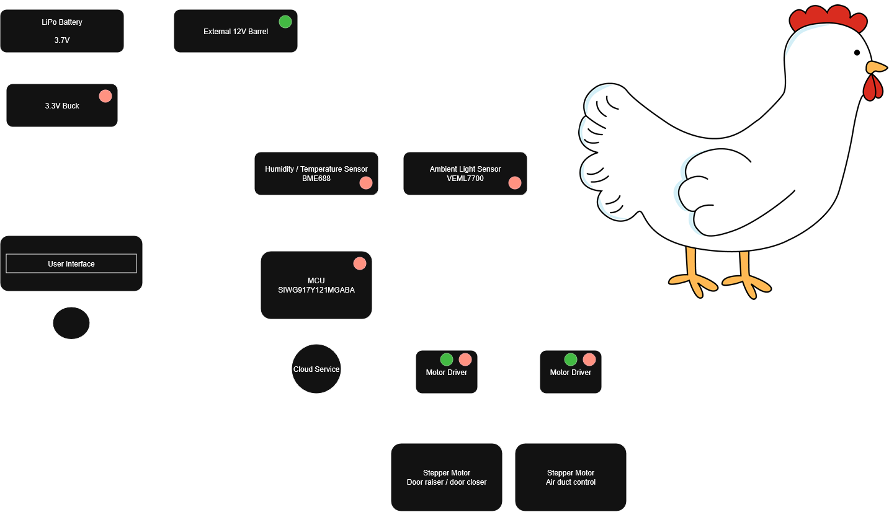

# a11g-final-submission

**Team Number: 30**

**Team Name: Cooped Up**

| Team Member Name | Email Address | GitHub Username |
| ---------------- | -------------------------- | --------------- |
| Alexander Yu     | ayu2126@seas.upenn.edu     | lerntuspel      |
| Ben Sirota       | sirotab@seas.upenn.edu     | 21bsirota       |

**GitHub Repository URL: [https://github.com/ese5160/a11g-final-submission-s26-s26-t30-coopedup/tree/main](https://github.com/ese5160/a11g-final-submission-s26-s26-t30-coopedup/tree/main)**

## 1. Video Presentation

## 2. Project Summary

- Device Description

Our device is a Smart Chicken Coop. It can monitor the habitat of your chickens, as well as control doors and vents on your coop.
We were inspired to do this project by a coworker who was keeping chickens, and didn't want to have to spend so much time going outside to check on them.
We use the internet to allow the user to monitor/control their chicken coop from anywhere, even if they are on the opposite side of the world as their chickens.

- Device Functionality

Our device is designed to include every sensor on an I2C bus, so the data can be sampled and sent to our Node-RED dashboard using MQTT. The dashboard then takes user input and decides whether to open/close the doors/vents, and sends commands back to our device.
We included a BME688 temperature/humidity/air pressure sensor, and a VEML7700 ambient light sensor. The stepper motors are driven by A4988 stepper drivers.

- Challenges

The biggest difficulty we faced was that our original design had some of our stepper driver control ports connected to GPIO pins on our microcontroller that were reserved. This resulted in us having to do manual reworks to the boards, cutting traces and soldering external wires onto them.

- Prototype Learnings

We learned a lot of lessons from building this device. In the future, we would put test points on all of our GPIO pins and wires, even if we think it's not necessary. We would also simplify our power architecture, so that our 12V power supply could power everything, instead of having to have two separate power inputs. We would also improve our silkscreens, so we could keep track of all of our test points and buttons and LEDs.

- Next Steps & Takeaways

For project improvements, we would implement the PIR motion sensors and a camera, so we could send photos to the user and keep track of the moving chickens.
We learned a lot from this course, such as PCB design, integration, and designing for issues instead of designing for a perfect world where everything goes correctly.

- Project Links

[Node-RED Instance](http://40.75.82.175:1880/dashboard/page1)

[Altium PCB Link](https://upenn-eselabs.365.altium.com/designs/C8490577-CECD-403B-99C1-078505D1E597#design)

## 3. Hardware & Software Requirements

### Hardware Requirements Specification (HRS)

| ID     | Description | Validation Outcome|
| ------ | ------------------------------------------- | ---------------------------------------- |
| HRS-01 | The temperature sensor shall measure temperature of a 1 cubic meter enclosed space within 1 degree C accuracy. | ✅ |
| HRS-02 | Ambient light sensor shall record outdoor brightness between 0 and 100000 lux | ✅ |
| HRS-03 | Automatic door shall be fully open within 30 seconds of request | ✅ |
| HRS-04 | Automatic door shall be fully closed within 30 seconds of request | ✅ |
| HRS-05 | Humidity control ducts shall fully open within 30 seconds of request | ✅ |
| HRS-06 | Humidity control ducts shall fully close within 30 seconds of request | ✅ |

### Software Requirements Specification (SRS)

| ID     | Description | Validation Outcome|
| ------ | ------------------------------------------- | ---------------------------------------- |
| SRS-01 | Temperature and humidity reading shall be recoreded in logs at a frequency of at least 4 times per hour over I2C. | ✅ |
| SRS-02 | On request from user application, latest log recording shall be sent to user over wifi. | ✅ |
| SRS-03 | The MCU shall detect when temperature inside coop is at or below 0C and singal outdoor watering bowls to start heating. | ❌ |
| SRS-04 | MCU shall recieve sunrise and sunset times from weather forcast once a day and retry 5 times if failed, to then fall back to using light sensor to determine when to open door | ✅ |
| SRS-05 | MCU shall recieve weather forcast once a day and retry every half hour if failed | ✅ |
| SRS-06 | Chicken activity level shall be logged with motion sensor trigger counts at a range of 0-3 meters. | ❌ |
| SRS-07 | Ambient Light Sensor shall communicate over I2C and start logging light level every 5 minutes starting from 30 minutes from sunrise/set times are predicted | ✅ |
| SRS-08 | The system shall do a calculate the difference between measured humidity of coop and outside humidity. If the coop is more humid, motors shall open the ducts automatically. If the coop is less humid, the ducts shall remain closed unless user override | ✅ |

## 4. Project Photos & Screenshots

## 5. Codebase

[Final Embedded C Firmware Codebase](https://github.com/ese5160/final-project-firmware-s26-t30-coopedup/tree/main/A09G/wifi_embedded_mqtt_client_soc)

[Node-RED Dashboard Code](https://github.com/ese5160/final-project-firmware-s26-t30-coopedup/blob/main/A09G/node-red.json)
